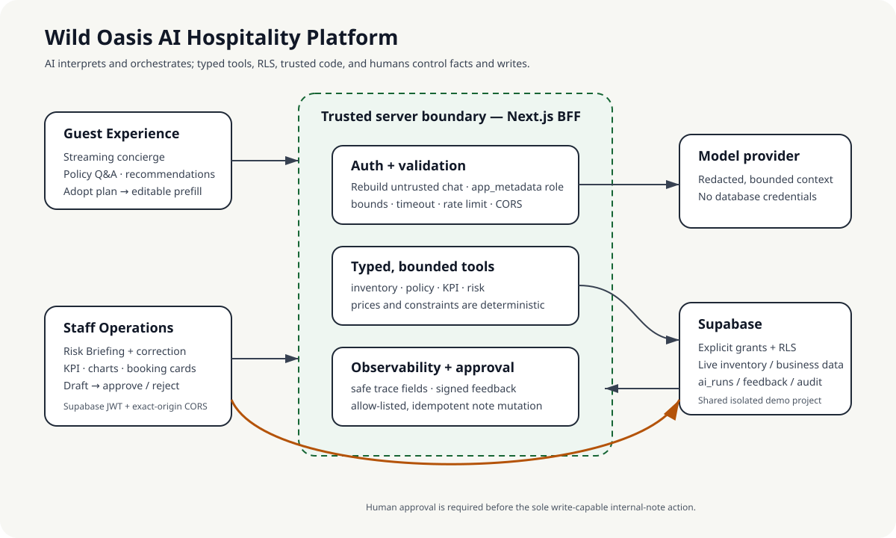

# Wild Oasis AI Hospitality Platform — Staff Operations

Wild Oasis AI Hospitality Platform is a two-surface portfolio project for an
AI-assisted accommodation business. This React/Vite staff application handles
bookings, check-in/out, reporting, risk Briefings and an operations Copilot;
the paired Next.js application serves guests and owns the shared AI BFF.

The business problem is not “add a chatbot.” Guests need to translate dates,
party size, budget and policy questions into a safe reservation plan, while
staff need fast risk and performance answers without giving a model unrestricted
database access. The platform therefore lets AI interpret and orchestrate, but
keeps inventory, pricing, authorization and writes inside typed tools, Supabase
RLS and explicit human approval.

## Product map and links

| Surface | What it demonstrates | Source | Production |
| --- | --- | --- | --- |
| Guest Experience + AI BFF | Streaming room advice, policy Q&A, reservation prefill | [paired website](https://github.com/notjustkoala/the-wild-oasis-video/blob/codex/ai-hospitality-platform/README.md) | Not deployed/verified |
| Staff Operations | Risk Briefing, KPI/chart/booking cards, approval workflow | this repository | Not deployed/verified |
| Portfolio evidence | architecture, case study, demo, eval and resume claims | [portfolio index](docs/portfolio/CASE_STUDY.md) | Local/versioned artifacts |

Cross-repository links target the intended `codex/ai-hospitality-platform`
branches in two independent GitHub origins. The current Feature06 changes are
not pushed, so those links must be clicked and verified after publication.

`guest.example` and `staff.example` describe target roles only; they are not
live links. Real HTTPS URLs must be recorded only after deployment and
[production smoke verification](docs/portfolio/DEPLOYMENT_RUNBOOK.md).



The Staff browser contains only a publishable Supabase key and calls the BFF
with the current employee JWT. The BFF revalidates `app_metadata.role`, applies
exact-origin CORS, invokes bounded tools, and stores privacy-minimized telemetry.
The only write-capable Copilot action drafts an internal note and pauses for an
employee to approve or reject it.

## Engineering choices

- **Typed, bounded tools:** the model never calculates prices or receives a
  general SQL/database tool.
- **Human-controlled writes:** Concierge only prefills a reservation; Copilot
  can only draft one allow-listed internal-note mutation.
- **Evidence layers stay separate:** offline contract eval, HTTP fixture UI,
  real-model runs, development-database checks and production smoke are reported
  independently in the [AI Eval Report](docs/portfolio/AI_EVAL_REPORT.md).
- **Graceful degradation:** AI timeout/denial leaves ordinary booking, check-in,
  checkout and filtering flows available.
- **No browser secrets:** service/model/feedback-signing secrets stay in the
  Next.js server environment and must never use a `VITE_` prefix.

## Five-minute demo

The interview path is Guest complex request → live recommendation → editable
reservation prefill; Staff special request → Risk Briefing → correction; then
Copilot business question → KPI/chart/order evidence → reject or approve a note.
It closes with an unauthorized request and tracing/eval evidence. Follow the
[timed demo script](docs/portfolio/DEMO_SCRIPT.md); the real backup recording and
three human-timed rehearsals are still pending.

Demo identities are deployment-time placeholders, never credentials in Git:
`DEMO_GUEST` is a normal customer; `DEMO_ADMIN` has the existing admin role and
is used only for the admin-only Risk Briefing; `DEMO_STAFF` has
`app_metadata.role=staff` for Copilot read/approval flows; and `DEMO_DENIED` has
no employee role or is logged out. Creation, rotation and reset rules are in the
[deployment runbook](docs/portfolio/DEPLOYMENT_RUNBOOK.md).

## Local setup

Requirements: Node.js 22+ and npm.

```bash
npm install
copy .env.example .env.local
npm run dev
```

Configure these browser-safe Vite variables in `.env.local`:

- `VITE_SUPABASE_URL`
- `VITE_SUPABASE_PUBLISHABLE_KEY`
- `VITE_AI_BFF_URL` for the customer Next.js server (development defaults to
  `http://127.0.0.1:3000`)

`VITE_SUPABASE_ANON_KEY` is accepted only for compatibility with an existing
legacy project. Never put a secret/service-role key in a `VITE_` variable.
The admin browser never receives the Gemini key. It sends the current Supabase
access token to the BFF, where the employee is revalidated before any insight
is read, generated, or reviewed.

## AI risk Briefing

Booking details keep the original observation visible beside cached AI
summary, text severity, risk tags, actions, and confidence. Employees explicitly
start or retry generation, can force reanalysis, and can record a
correct/partially-correct/incorrect verdict with optional corrected tags and
notes. Feedback is stored alongside the original AI result for later evals.

Today's activity performs one Supabase relationship query for already-cached
insights. It never starts generation and does not issue one BFF request per
row. A failed AI request leaves check-in, checkout, and all booking operations
unchanged.

## Operations Copilot

The floating **Operations Copilot** drawer sends the employee's Supabase access
token and a natural-language question to the customer application's
`/api/ai/admin` BFF. Results are rendered as KPI cards, cabin performance bars,
booking lists, and a tool timeline. The server exposes only five fixed,
bounded read tools and never sends guest names, contact details, raw
observations, or complete booking rows to Gemini.

Booking KPIs match the dashboard reporting basis: the range uses `created_at`,
cancelled bookings remain included, and `totalRevenue` sums `totalPrice` only
because that field already includes extras. `extrasPrice` is reported
separately as `extrasRevenue` and is not added again. Each result also exposes
compact expandable `sourceIds` evidence.

The sole write action drafts an internal booking note. The drawer shows the
exact booking and note text and requires an explicit employee approval or
rejection. Rejected drafts are not retried, and the server's idempotent audit
transaction can update only the staff-only internal note field. Set
`AI_ADMIN_ORIGIN` on the customer server for a deployed admin origin; local
development permits the Vite origins described above.

For the approval-chain acceptance check, send one explicit booking command in a
single turn, for example: `Draft an internal note for booking 123: Follow up on
payment`. Verify that the drawer shows the exact booking and note, reject once
to confirm no booking field changes, then repeat and approve to confirm only
`bookings.internalNote` changes.

Feature 03 is applied to the dedicated Dev Supabase project; the original
project and database were not modified. The customer worktree's append-only
`20260824163705_optimize_ai_operations_advisors.sql` migration adds the missing
foreign-key indexes, normalizes Feature 03 RLS expressions, and preserves the
constrained approval RPC contract.

## Quality commands

```bash
npm run lint
npm run typecheck
npm run test
npm run build
npm run check
npm run docs:check
npm run smoke:production # requires a real STAFF_PRODUCTION_URL
```

`check` runs lint, the incremental TypeScript boundary, offline Vitest tests,
and a production build. ESLint is scoped to `src/`; generated `dist/` and
coverage output are excluded. Stable JSX remains JavaScript, while new `.ts`
and `.tsx` modules are checked by `tsc`.

Page components are loaded with `React.lazy` so the initial bundle does not
contain every operations screen. Tests mock Supabase and must never contact a
remote database.

`docs:check` validates local Markdown links without network access.
`smoke:production` rejects missing, local, private and placeholder URLs; it has
not been run because no real deployment exists. The versioned lint, test, build, bundle, and Lighthouse baseline for both
applications is recorded in [docs/quality-baseline.md](docs/quality-baseline.md).

## Limitations and future work

- There is no verified public URL, production smoke result, distributable demo
  account, backup video or independent-reader acceptance yet.
- The saved screenshots are Playwright HTTP fixtures, not proof of a model,
  database or production deployment.
- A fixed-provenance, transaction-locked demo reset RPC and default-disabled
  daily Cron route are versioned locally, but the migration, baseline seed and
  Cron have not been applied or activated in a remote Demo Project.
- Live-model cost is unknown because no dated, sourced price file was provided;
  no growth, conversion, revenue or uptime claim is made.
- Future work includes public deployment, platform WAF/distributed throttling,
  a privacy-reviewed 2–3 minute recording and human validation of the five-minute
  narrative.

## Feature05 validation reference

`npm run test:e2e` exercises the real staff UI with HTTP fixtures for auth,
booking data, AI answers and feedback; it makes no model calls or database
writes. `npm run test:e2e:security` runs the timeout/403 paths. The tests start
a Vite server on port 5174 and use installed Edge; set `E2E_BROWSER_CHANNEL=chrome`
for Chrome. Run `npm run check` for lint, types, unit tests and production build.

Success, empty results, timeout and denied screenshots are saved to
`output/playwright/feature05-*.png`; JSON results and failure traces are under
`test-results/`. The screenshot trace UUID and feedback receipt are fixtures,
not real database records. AI failure leaves `Continue with Bookings` and the
existing filters available. An AI response shows its request ID and controlled
Helpful/Not helpful feedback, with an explicit saved/error state.

The website/BFF owns the Feature05 migrations, server secrets, rate limiting,
offline/live evaluation, retention cleanup and `ai:observe -- trace UUID`
diagnostics. Follow its [deployment and observability instructions](https://github.com/notjustkoala/the-wild-oasis-video/blob/codex/ai-hospitality-platform/README.md#feature05-evaluation-and-observability).
Set only `VITE_AI_BFF_URL` in this frontend; configure the matching exact
`AI_ADMIN_ORIGIN` on the BFF. Never add a model or Supabase service key to a
`VITE_` variable. Browser CORS must allow the existing bearer token and expose
the AI trace/feedback headers.

The shared [progress record](docs/FEATURE05_PROGRESS.md) distinguishes offline,
mock HTTP, live model and real database evidence. Human review of the four
screens and trace diagnostics remains required before formal Feature05 closure.
