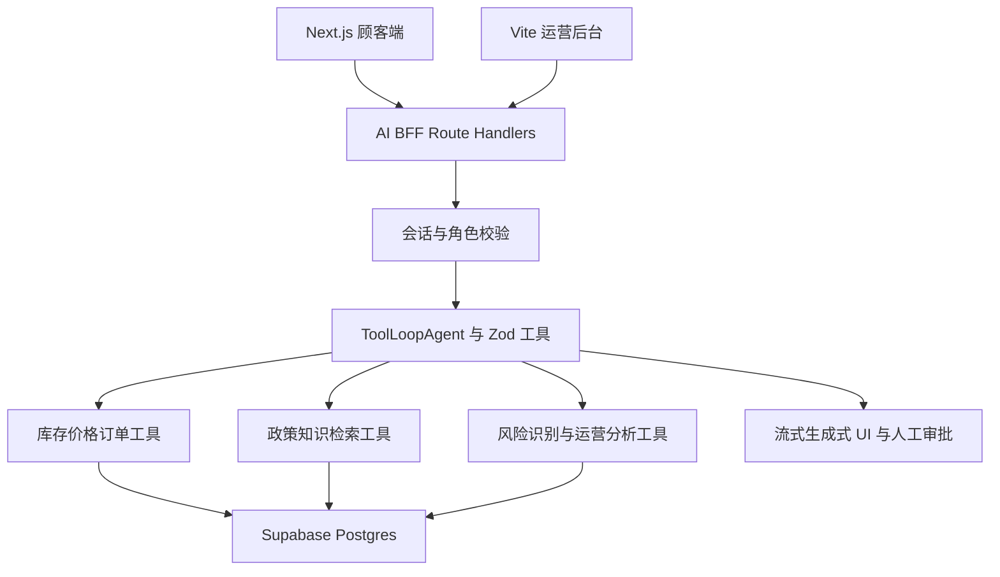
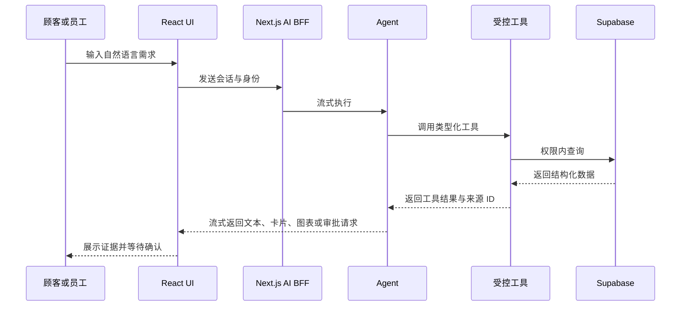
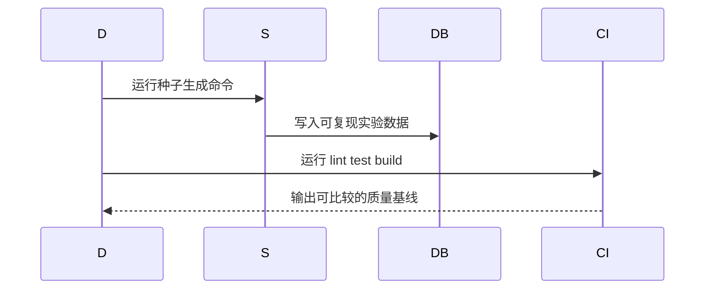
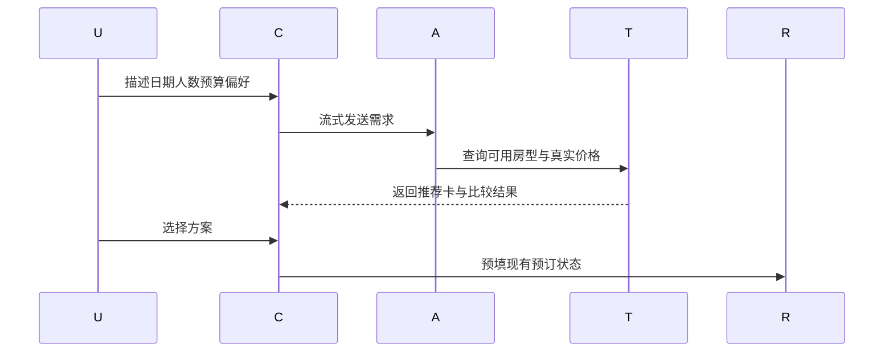
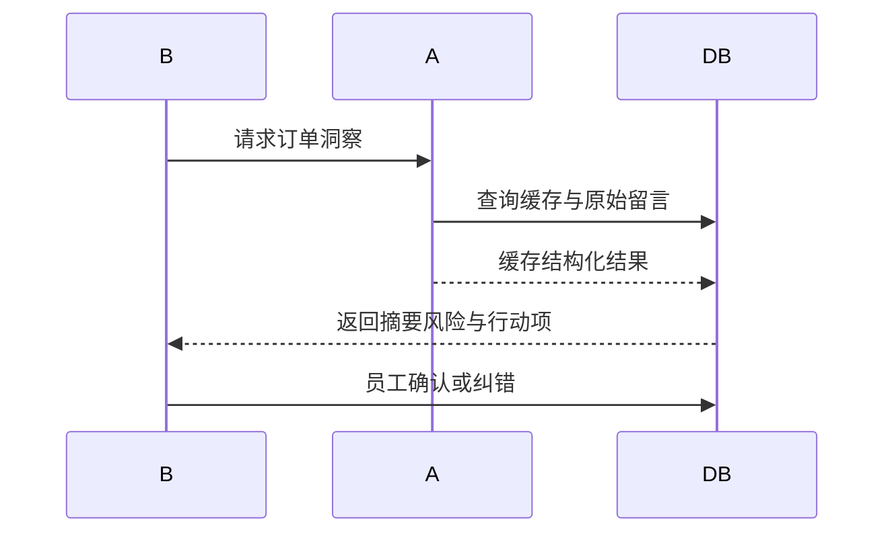
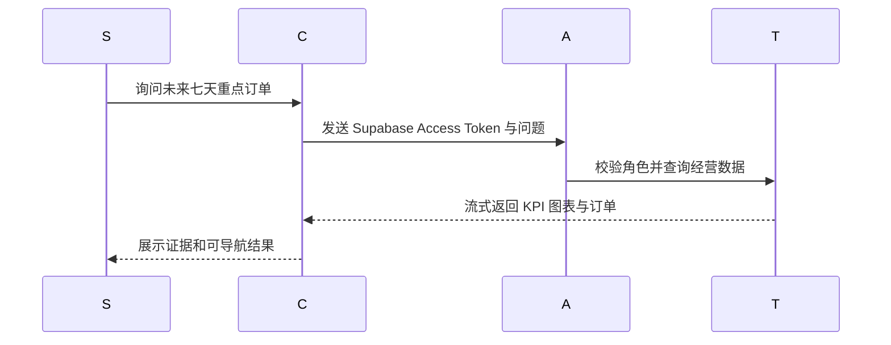
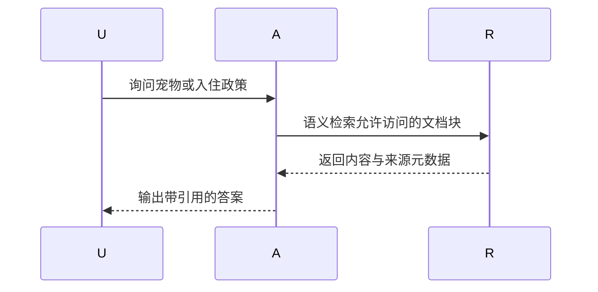
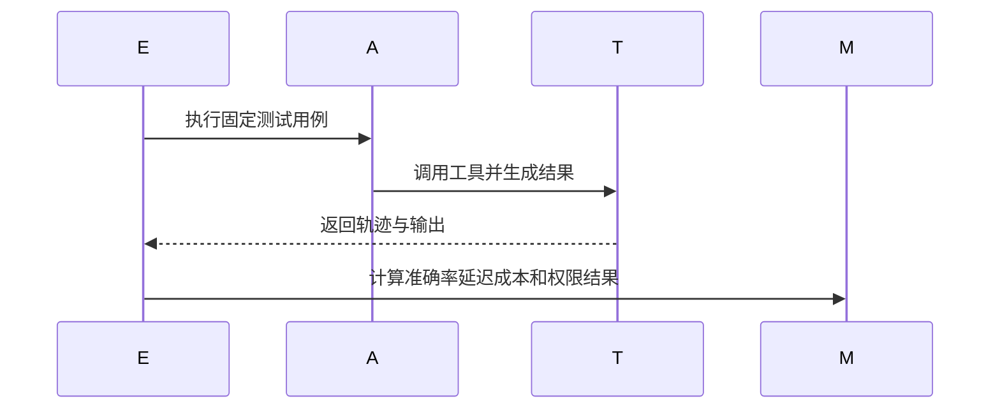
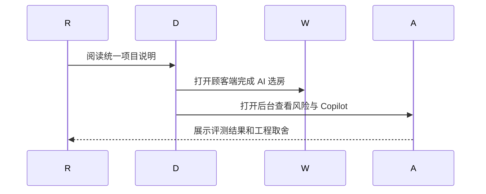

# Wild Oasis AI 酒店经营平台技术方案

------禁止调整，保持原样------
> **For Claude:** REQUIRED SUB-SKILL: Use spec-subagent-driven-development to implement this plan task-by-task.


------禁止调整，保持原样------

**基于需求**: 2026-08-02 至 2026-08-03 对话需求与两个现有代码仓库

**Goal:** 将顾客预订网站与酒店运营后台升级为可演示、可评测、可写入前端求职简历的双端 AI 酒店经营平台。

**Architecture:** 以 Next.js 顾客端作为 AI BFF，集中保存模型密钥、身份验证、工具定义和流式响应；顾客端与 Vite 运营后台消费同一套类型化 AI 接口。结构化库存和订单数据通过受控 Supabase 查询工具获取，政策文档才进入 RAG，所有敏感写操作必须经过权限校验和人工确认。

**Tech Stack:** React 18、Next.js App Router、Vite、Supabase、TanStack Query、Vercel AI SDK、TypeScript、Zod、Vitest、Playwright、pgvector

---

## 功能点索引

1. **工程基线与演示数据** - 清理课程痕迹，建立 TypeScript、测试、构建与可复现实验数据基线 → [详见实施步骤](feature/00-engineering-baseline.md)
2. **AI 选房与预订顾问** - 用实时库存工具、流式推荐卡片和预订预填完成顾客端核心 AI 闭环 → [详见实施步骤](feature/01-ai-concierge.md)
3. **订单风险识别与入住 Briefing** - 将自由文本需求转为可审核的风险标签、摘要和员工待办 → [详见实施步骤](feature/02-booking-risk-briefing.md)
4. **AI 运营 Copilot** - 用自然语言查询经营数据并渲染 KPI、图表、订单列表和受控操作 → [详见实施步骤](feature/03-operations-copilot.md)
5. **政策知识库 RAG** - 为顾客政策与员工 SOP 提供带引用、带权限的知识检索 → [详见实施步骤](feature/04-policy-rag.md)
6. **评测、可观测与安全加固** - 建立固定 Eval、权限测试、调用追踪、成本与延迟指标 → [详见实施步骤](feature/05-evaluation-observability.md)
7. **作品集与简历交付** - 完成部署、案例文档、演示脚本和基于真实指标的简历表述 → [详见实施步骤](feature/06-portfolio-delivery.md)

## 技术架构

### 需求架构（描写与本需求相关的架构）


### 需求数据流时序（描写与本需求相关的架构）


### 技术栈
- **前端框架**: 顾客端 Next.js App Router；运营端 React + Vite
- **状态管理**: 顾客端 AI SDK UI 状态与现有 ReservationContext；运营端 TanStack Query
- **UI组件库**: 延续 Tailwind CSS 与 styled-components，AI 组件采用业务定制 Generative UI
- **AI 服务**: Vercel AI SDK + AI Gateway；实施时查询并固定当前可用模型 ID
- **数据与权限**: Supabase Postgres、Auth、RLS、pgvector
- **验证**: Vitest、React Testing Library、Playwright、AI SDK Mock Provider

### 目录结构
```
21-the-wild-oasis-website/
├── app/api/ai/                 # 顾客与员工 AI Route Handlers
├── app/_ai/agents/             # Agent 定义
├── app/_ai/tools/              # 受控业务工具
├── app/_ai/schemas/            # Zod 输入输出契约
├── app/_components/ai/         # 生成式 UI 组件
├── supabase/migrations/        # 两端共享的数据结构变更
└── tests/ai/                   # 工具与 Eval 测试

17-the-wild-oasis/
├── src/features/ai-copilot/    # 运营 Copilot UI
├── src/features/booking-insights/
├── src/services/apiAi.js       # 携带 Supabase Token 的流式客户端
└── tests/                      # 运营端组件与流程测试
```

## 功能点方案

> **注意**: 每个功能点的详细实施步骤都在独立的子文档中

### 工程基线与演示数据
**技术方案**: 先修复构建、lint、测试、价格/库存可信性和文档基线，新 AI 代码增量使用 TypeScript，不做全仓强制迁移。建立可重复生成的季节性订单与特殊需求数据，并在最终下单时由服务端重新校验库存、容量和价格，确保后续推荐与经营分析有可信事实来源。
**主要组件**: 构建脚本、测试配置、种子数据生成器、共享数据库迁移
**关键文件**: 两端 `package.json`、后台旧版本文件、`supabase/migrations/`、测试配置

**时序图**:


**详细实施**: [详见 00-engineering-baseline.md](feature/00-engineering-baseline.md)

### AI 选房与预订顾问
**技术方案**: 由 Agent 调用实时库存、房型、价格和政策工具，UI 将工具结果渲染为推荐卡、比较表和预订预填操作。模型不计算价格、不直接创建订单，最终提交仍走现有 Server Action。
**主要组件**: ConciergePanel、CabinRecommendationCard、工具状态、AI Route Handler
**关键文件**: 顾客端 `app/api/ai/concierge/`、`app/_ai/`、`ReservationContext.js`

**时序图**:


**详细实施**: [详见 01-ai-concierge.md](feature/01-ai-concierge.md)

### 订单风险识别与入住 Briefing
**技术方案**: 对非空 observations 进行结构化分析并持久化，后台展示摘要、风险标签、行动项和人工反馈。分析失败不得影响原始订单，支持幂等重试与人工重新生成。
**主要组件**: BookingInsightCard、TodayBriefing、风险 Schema 与缓存表
**关键文件**: 后台 BookingDataBox、TodayActivity，顾客端 AI BFF，Supabase migration

**时序图**:


**详细实施**: [详见 02-booking-risk-briefing.md](feature/02-booking-risk-briefing.md)

### AI 运营 Copilot
**技术方案**: 先交付只读经营查询，再加入单一、低风险且必须审批的写工具。工具使用固定查询和明确返回类型，结果渲染成现有仪表盘风格的 KPI、图表和订单列表。
**主要组件**: CopilotDrawer、KpiResult、ChartResult、BookingResult、ApprovalCard
**关键文件**: 后台 `src/features/ai-copilot/`，顾客端 `app/api/ai/admin/`

**时序图**:


**详细实施**: [详见 03-operations-copilot.md](feature/03-operations-copilot.md)

### 政策知识库 RAG
**技术方案**: 只将酒店政策、FAQ 和员工 SOP 向量化，结构化库存与订单继续使用普通工具。每个回答必须返回可点击引用，并根据 public/staff scope 与 RLS 控制可见范围。
**主要组件**: 知识文档表、Chunk/Embedding 管道、检索工具、Citation UI
**关键文件**: `supabase/migrations/`、`app/_ai/tools/policy-search.ts`、AI 引用组件

**时序图**:


**详细实施**: [详见 04-policy-rag.md](feature/04-policy-rag.md)

### 评测、可观测与安全加固
**技术方案**: 用固定数据集验证工具选择、约束满足、引用正确性和权限边界，并记录延迟、Token、工具执行与反馈。单元测试使用 Mock Provider，少量线上 Eval 才调用真实模型。
**主要组件**: Eval Fixtures、AI Run 日志、反馈控件、安全测试
**关键文件**: 两端测试目录、`ai_runs` migration、Agent callbacks

**时序图**:


**详细实施**: [详见 05-evaluation-observability.md](feature/05-evaluation-observability.md)

### 作品集与简历交付
**技术方案**: 将两个仓库统一叙述为一个双端产品，提供架构图、演示账号、测试结果、录屏和面试演示脚本。简历只使用实际测得的数据，不写未经验证的转化率或准确率。
**主要组件**: README、Case Study、Demo Script、截图与部署配置
**关键文件**: 两端 README、`docs/portfolio/`、部署配置

**时序图**:


**详细实施**: [详见 06-portfolio-delivery.md](feature/06-portfolio-delivery.md)

## 实施顺序

1. **工程基线与演示数据** - 后续所有 AI 效果、测试与简历指标都依赖稳定工程和可重复数据
2. **AI 选房与预订顾问** - 最快形成可被用户体验的端到端 AI 闭环
3. **订单风险识别与入住 Briefing** - 复用结构化输出并连接顾客端输入与后台运营
4. **AI 运营 Copilot** - 在已有业务工具、权限和风险数据之上增加复杂生成式 UI
5. **政策知识库 RAG** - 在掌握工具调用后再学习 Embedding、检索、权限和引用
6. **评测、可观测与安全加固** - 贯穿开发，在功能稳定后完成系统化指标与安全验证
7. **作品集与简历交付** - 使用最终真实指标完成部署、案例和简历包装

## 学习与里程碑计划

默认投入为每周 10–12 小时，学习与编码比例约 3:7；总周期 10 周。若每周只有 5–6 小时，保持顺序不变并扩展为 16–18 周。

| 周次 | 学习主题 | 开发里程碑 | 周末验收 |
|---|---|---|---|
| 第 1 周 | TypeScript 渐进迁移、测试金字塔、服务端事实校验 | 清理工程、统一价格公式、服务端重查库存、加入 check 与演示数据 | 两端质量命令稳定，冲突订单和篡改价格无法入库 |
| 第 2 周 | LLM 消息、结构化输出、Tool Calling、流式响应 | 建立 AI BFF、Zod Schema、Mock 模型实验 | 本地流式返回一个类型化工具结果 |
| 第 3–4 周 | Generative UI、工具状态、取消/重试 | 完成 AI 选房顾问与推荐卡片 | 自然语言需求可预填现有预订流程 |
| 第 5 周 | 分类 Schema、幂等缓存、人工反馈 | 完成订单风险识别和入住 Briefing | 典型留言能产生可审核行动项 |
| 第 6–7 周 | Agent 权限、数据型 UI、审批流程 | 完成运营 Copilot 只读查询和一个审批操作 | 问题可变为 KPI/图表/订单组件 |
| 第 8 周 | Embedding、Chunk、Hybrid Search、引用 | 完成 public/staff 政策检索 | 回答有来源且越权检索被拒绝 |
| 第 9 周 | Eval、Tracing、Prompt Injection、成本控制 | 完成 50–100 条 Eval 与运行日志 | 形成真实准确率、P95 和成本报告 |
| 第 10 周 | 技术叙事、性能、部署与演示 | README、录屏、案例页和简历 bullet | 5 分钟内完整演示三个核心场景 |

## 范围控制

- 第一个可投递版本截止于功能点 3：AI 选房顾问 + 风险 Briefing + 基础评测。
- 功能点 4–5 是增强竞争力的第二批，不阻塞第一版作品集。
- 暂不做模型训练、微调、多智能体自治、复杂 MCP、自动定价和真实邮件发送。
- 所有新 AI 代码使用 TypeScript；现有业务代码只按修改需要渐进迁移。
- 每个功能点独立提交，只有通过该功能点的自动验证和人类演示后才进入下一阶段。
