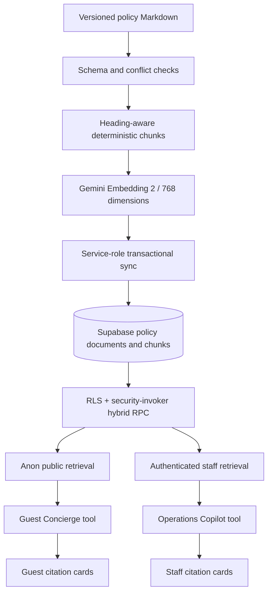
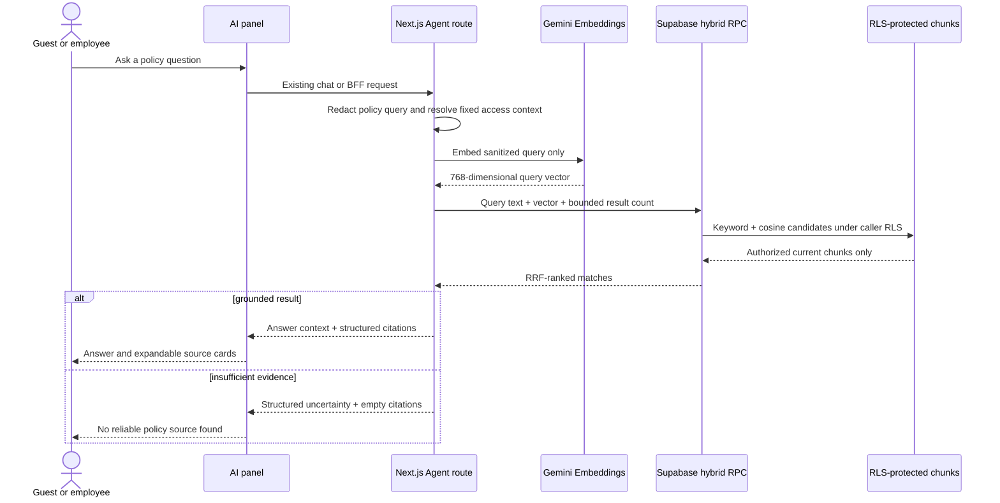
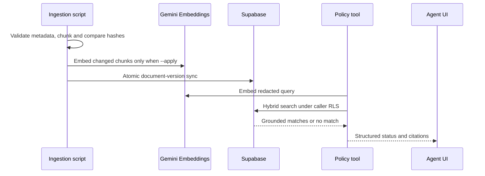

# Feature 04：政策知识库 RAG 技术方案

------禁止调整，保持原样------
> **For Claude:** REQUIRED SUB-SKILL: Use spec-subagent-driven-development to implement this plan task-by-task.


------禁止调整，保持原样------

**基于需求**: `docs/design/2026-08-29-policy-rag/DRAFT.md`

**Goal:** 为顾客 Concierge 与员工 Operations Copilot 提供按角色隔离、可版本化、可追溯引用且低召回时不编造的酒店政策检索。

**Architecture:** Markdown 是政策事实源；受控脚本校验、按标题分块并用 Gemini Embedding 2 生成 768 维向量，再增量同步到 Supabase。Postgres 使用全文检索与 pgvector HNSW 的混合召回，`SECURITY INVOKER` RPC 和 RLS 根据 Supabase 身份限定 public/staff 范围；Agent 只消费结构化工具结果，引用由 UI 直接渲染而不是让模型生成。

**Tech Stack:** Next.js 14、React 18、Vercel AI SDK 7、`@ai-sdk/google`、Supabase Postgres、pgvector（Dev 可用默认 0.8.2，尚未启用）、Vitest；后台继续使用 Vite、React、styled-components 与 Supabase Auth。

---

## 功能点索引

1. **政策知识库 RAG** - 将知识源治理、权限检索、双端 Agent 接入与可访问引用作为一个完整可交付功能 → [详见实施步骤](feature/policy-rag.md)

## 技术架构

### 需求架构（描写与本需求相关的架构）


### 需求数据流时序（描写与本需求相关的架构）


### 技术栈
- **顾客端/BFF**: Next.js App Router、React、AI SDK `ToolLoopAgent`、AI SDK `embed`/`embedMany`
- **模型**: 直连 Google `gemini-embedding-2`，固定 768 维；生成式回答继续复用现有 Concierge 模型配置
- **数据层**: Supabase Postgres、`vector(768)`、HNSW cosine、GIN `tsvector`、RRF 混合检索 RPC
- **权限**: Supabase `anon`/`authenticated`、JWT `app_metadata.role`、RLS、`SECURITY INVOKER`
- **后台 UI**: Vite、React、styled-components、现有 Operations BFF JSON 契约
- **验证**: Vitest、Testing Library、migration contract、Dev 数据库角色隔离验收、两个仓库 `npm run check`
- **官方依据**: [Supabase Hybrid Search](https://supabase.com/docs/guides/ai/hybrid-search)、[HNSW Indexes](https://supabase.com/docs/guides/ai/vector-indexes/hnsw-indexes)、[Row Level Security](https://supabase.com/docs/guides/database/postgres/row-level-security)、[Gemini Embeddings](https://ai.google.dev/gemini-api/docs/embeddings)

### 目录结构
```text
21-the-wild-oasis-website-ai/
├── content/policies/{public,staff}/
├── app/_ai/policies/
├── app/_ai/providers/policy-embedding-model.ts
├── app/_ai/tools/policy-search.ts
├── app/_components/concierge/PolicyCitations.tsx
├── scripts/ingest-policies.mjs
├── supabase/migrations/<generated>_policy_rag.sql
└── tests/ai/policy-*.test.*

17-the-wild-oasis-ai/
└── src/features/operations-copilot/PolicyCitations.tsx
```

## 功能点方案

> **注意**: 每个功能点的详细实施步骤都在独立的子文档中

### 政策知识库 RAG
**技术方案**: 使用版本控制下的 Markdown 作为单一政策来源，以内容 Hash 驱动增量 Embedding 和事务同步。检索在 Postgres 内合并语义与关键词排名，RLS 按调用身份限定 Chunk；Concierge 和 Operations 复用同一工具契约，但分别使用 anon 与员工 JWT client，并在各自 UI 中渲染真实工具引用。

**主要组件**: Policy content parser、Embedding resolver、transactional ingestion RPC、hybrid retrieval RPC、AI SDK policy tool、Guest/Staff citation components

**关键文件**: `content/policies/`、`app/_ai/policies/`、`app/_ai/tools/policy-search.ts`、`supabase/migrations/<generated>_policy_rag.sql`、两端 `PolicyCitations.tsx`

**时序图**:


**详细实施**: [详见 policy-rag.md](feature/policy-rag.md)

## 实施顺序

1. **权威政策文档与契约** - 先固定内容、元数据、Citation 和检索输出，避免数据库与 UI 反复变更。
2. **数据库与权限边界** - 先验证表、RLS、RPC、grant 和角色隔离，再允许任何应用调用。
3. **内容校验与安全增量导入** - 先通过本地 check/dry-run，再显式 apply 变化 Chunk。
4. **检索工具与 Eval** - 校准 Chunk、RRF 和证据阈值，先证明 grounded/insufficient-evidence 行为。
5. **Concierge 接入与引用** - 顾客端仅使用 anon/public 检索，并移除硬编码非结构化政策。
6. **Operations 接入与引用** - 复用员工 JWT client，补齐 BFF union、运行时校验和 staff 标签。
7. **安全、回归与人工验收** - 执行越权、提示注入、中英文、无结果、增量更新和两仓库完整检查。
