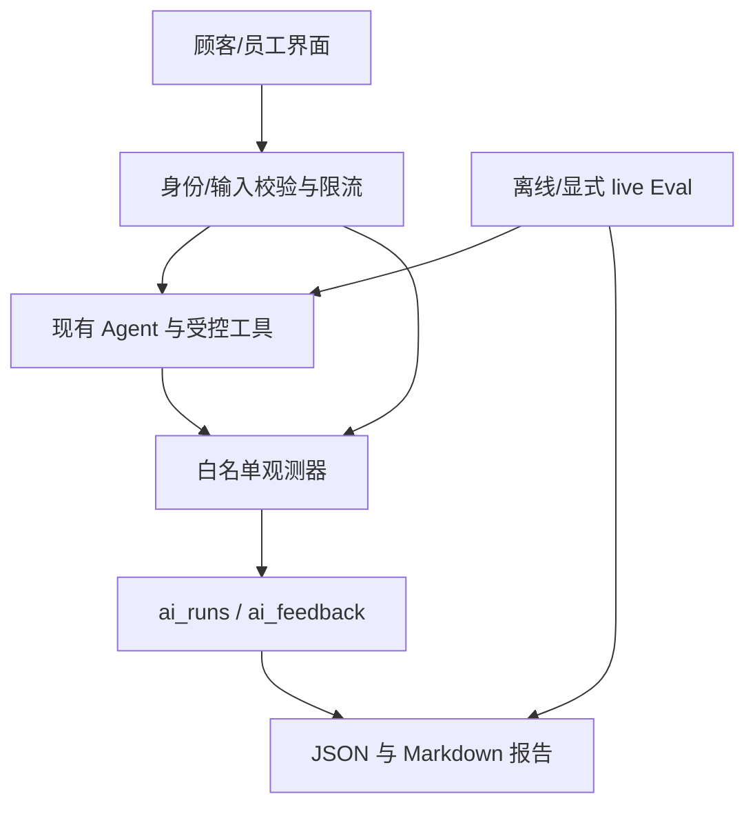
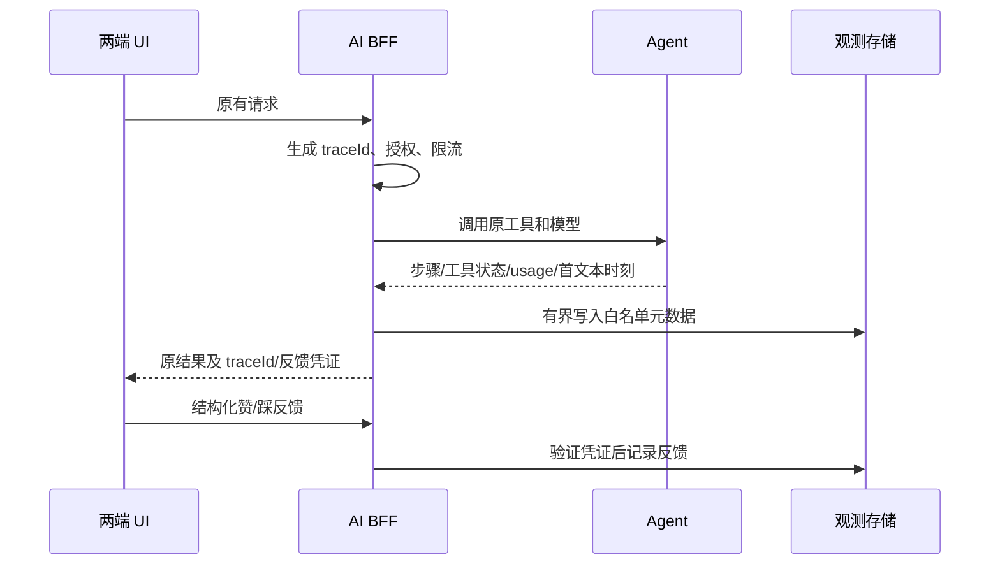
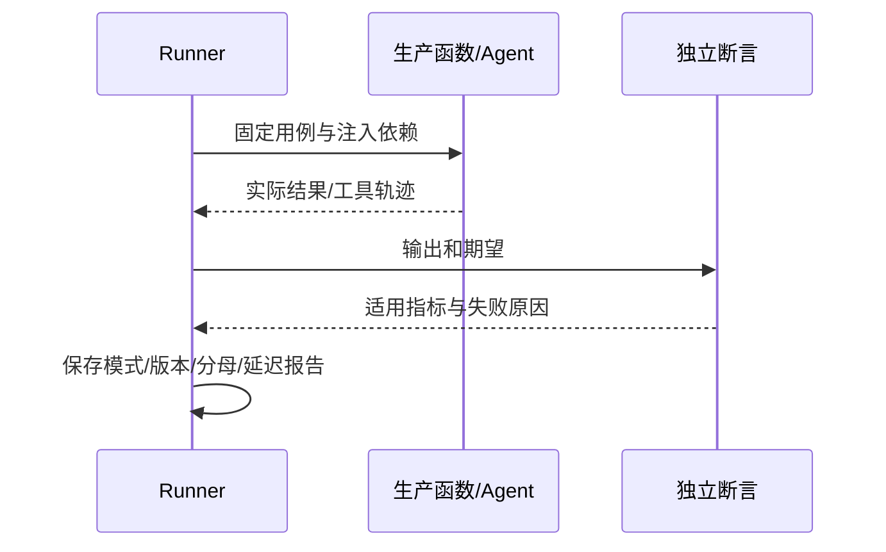

# Feature05 评测、可观测与安全加固技术方案

------禁止调整，保持原样------
> **For Claude:** REQUIRED SUB-SKILL: Use spec-subagent-driven-development to implement this plan task-by-task.


------禁止调整，保持原样------

**基于需求**: `../2026-08-03-ai-hospitality-platform/feature/05-evaluation-observability.md`；用户已要求开始 Feature05，并实时同步 Markdown 进度。

**Goal:** 为现有双端 AI 功能提供可复现评测、隐私安全的运行追踪、反馈及故障降级证据。

**Architecture:** 保持现有 Next.js BFF 和 Vite 员工端。复用现有 Agent、工具与权限测试，通过白名单观测模块收集元数据；隔离的服务端客户端只写观测表及限流表，业务工具继续使用原身份/RLS。默认离线 Eval 与显式 live 检查分开运行，报告说明每个指标的证据层级。

**Tech Stack:** 现有 React、Next.js 14、Vite、AI SDK 7.0.58、Vitest、Supabase Postgres；浏览器回归采用固定版本 Playwright。

---

## 功能点索引

1. **Feature05 可靠性验证闭环** - 评测、追踪、反馈与安全降级共同完成一个功能点 → [实施步骤](feature/evaluation-observability.md)

## 技术架构

### 需求架构（描写与本需求相关的架构）


### 需求数据流时序（描写与本需求相关的架构）


### 技术栈
- **前端框架**: 保留两端原框架，仅增量展示请求编号和反馈。
- **状态管理**: 保留现有 useChat / React state / TanStack Query。
- **UI组件库**: 复用原组件和样式，不引入新的 UI 库。

### 目录结构
```
21-the-wild-oasis-website-ai/
├── app/_ai/observability/         # 元数据、生命周期、存储、限流与反馈凭证
├── app/api/ai/feedback/           # 结构化反馈
├── tests/ai/fixtures/             # 50–100 条 JSONL
├── tests/ai/evals/                # 分层执行器、断言和报告
├── tests/e2e/                     # 浏览器关键路径
├── scripts/                      # Eval/观测报告命令
└── supabase/{migrations,tests}/   # 表、权限与事务验证
17-the-wild-oasis-ai/
├── src/features/operations-copilot/ # traceId 与反馈
└── docs/FEATURE05_PROGRESS.md      # 唯一实时进度
```

## 功能点方案

> **注意**: 每个功能点的详细实施步骤都在独立的子文档中

### Feature05 可靠性验证闭环
**技术方案**: 分层覆盖生产契约；默认测试只用注入的 Mock 模型/仓储，不读取真实客户信息。观测记录覆盖 Concierge、Operations 与 Booking Insight 的模型生成，RAG 作为其工具记录；输入拒绝、限流、配置失败、工具错误、取消和超时分别分类，日志不得复制 prompt、模型答复、tool input/output 或异常 message。
**主要组件**: Eval runner、run observer、feedback endpoint、双端反馈控件、SQL 权限和限流 RPC。
**关键文件**: 上述目录及现有三个生成入口、两端 package.json、README、.env.example。

**时序图**:


**详细实施**: [实施步骤](feature/evaluation-observability.md)

## 实施顺序

1. 固定用例与离线报告（F05-02/03），不得用 expected 值生成 actual 值。
2. 元数据追踪、反馈权限与存储（F05-04），再完成持久限流/错误映射（F05-05）。
3. 双端 E2E、真实数据库验证与显式 live 场景（F05-06）。
4. 全量检查、规范审查、人工验收与质量审查（F05-07）。人工验收前仍完成所有可自动完成的工作。

## 实现决策

- 使用安装包源码核对 SDK 7 的 `onStepEnd` / `onEnd` / `onToolExecutionEnd`，不直接使用网络搜索中旧版示例。模型和供应商保持现有配置。
- `ai_runs` 只保存受控 surface/status/error code、trace UUID、版本、模型标识、计数/耗时和工具名/状态。无原始用户 ID、IP、邮箱、文本或密钥。未知 usage/cost/TTFT 用 null。
- 观测持久化只由 server-only client 执行；表启用 RLS，匿名/普通用户不可读写；管理员按可信 app_metadata 获得只读权限。不把 service role 传给政策或经营工具。
- 反馈不接受自由文本，只接受受控评分。由服务端签发短时、绑定 traceId 的不可伪造凭证，traceId 本身不是写权限；一条 run 最多一条可更新反馈。凭证不得进入日志。员工端保持原 CORS 限制。
- 跨实例限流使用数据库原子 RPC，仅 service role 可调用。员工用验证后的身份摘要，匿名在未配置可信代理时用共享桶，不能信任任意 x-forwarded-for。返回 429/Retry-After；存储不可用时仅 AI 请求安全降级。
- 观测写失败不得覆盖原响应，使用有界超时；记录受控失败状态而非原异常。流式首文本时间才是 TTFT，非流式为 null；取消不记成功。
- 初始保留期 30 天，提供可显式执行的清理命令/SQL，不擅自创建云端定时任务。成本采用显式带日期的价格配置，无配置时未知，不假设免费或零成本。
- 浏览器测试要覆盖实际 UI 和请求路径；Mock HTTP 的 UI 回归须标为浏览器集成，不宣称验证了真实模型或数据库。live 默认关闭，不通过修改阈值获取通过。
- 自动化按可用环境推进，缺少依赖/网络/人工验收必须记录真实阻塞；不因任何单项通过就关闭阶段。

## 资料核对

- 本地 `node_modules/ai/src/agent/tool-loop-agent-settings.ts`（实际安装 7.0.58）是 callback 签名依据。
- [Supabase RLS](https://supabase.com/docs/guides/database/postgres/row-level-security)：显式 grants 与 RLS 分别验证。
- [Supabase changelog](https://supabase.com/changelog)：Markdown 入口抓取失败后查阅 HTML；实施时继续核对相关变更。
- 应用技能：`spec-technical-design`、`spec-subagent-driven-development`、`vercel:ai-sdk`、`supabase:supabase`；浏览器实现/验证时使用相应技能。
