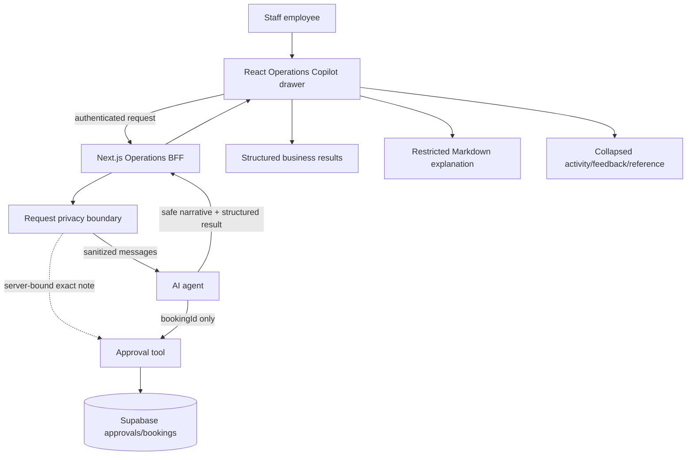
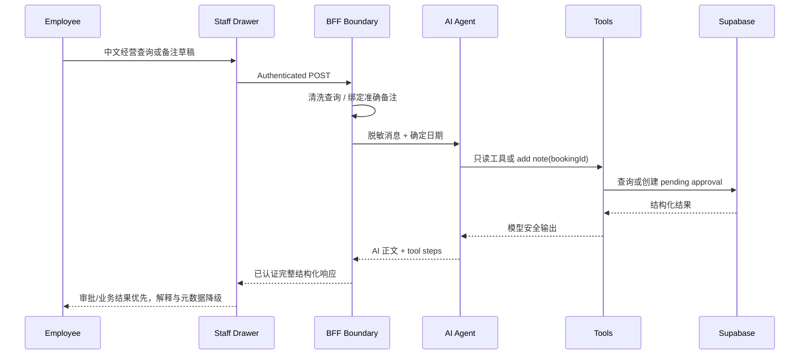
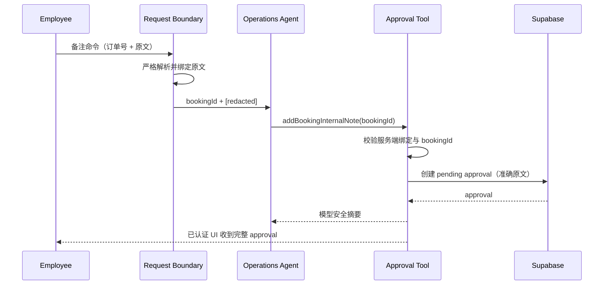
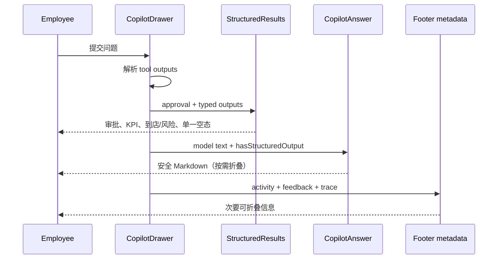

# Feature06 Copilot Production Recovery 技术方案

------禁止调整，保持原样------
> **For Claude:** REQUIRED SUB-SKILL: Use spec-subagent-driven-development to implement this plan task-by-task.


------禁止调整，保持原样------

**基于需求**: `docs/FEATURE06_PROGRESS.md` 中 F06-R5、2026-09-27 Production 人工验收截图与 trace

**Goal:** 修复 Staff Operations Copilot 的中文请求、隐私安全备注草稿与结果抽屉可读性，使 Production 人工验收可以安全继续。

**Architecture:** Guest/BFF 继续作为 Staff AI 的安全边界：先在服务端清洗经营查询，并把备注原文绑定在模型上下文之外，再通过现有审批 RPC 执行草稿、拒绝与批准。Staff React/Vite 客户端只消费已认证的结构化结果，重新组织呈现层级，不改变现有 API 数据契约。

**Tech Stack:** Next.js 14、Vercel AI SDK 7、Supabase、React 18、Vite、styled-components、Vitest、Testing Library、Playwright

---

## 功能点索引

1. **Copilot 中文请求与隐私安全备注管线** - 补齐窄范围中文语法和确定日期，并把备注原文绑定在模型上下文之外 → [详见实施步骤](feature/privacy-safe-request-pipeline.md)
2. **Copilot 结构化结果抽屉** - 以审批和业务结果为主，安全渲染 AI Markdown，并折叠技术元数据 → [详见实施步骤](feature/structured-results-drawer.md)

## 技术架构

### 需求架构（描写与本需求相关的架构）


### 需求数据流时序（描写与本需求相关的架构）


### 技术栈
- **Staff 前端**: React 18、Vite、styled-components、react-markdown
- **BFF/Agent**: Next.js 14、Vercel AI SDK 7、Zod
- **数据与授权**: Supabase Postgres/Auth/RPC，受信 `app_metadata.role`
- **状态管理**: React local state；沿用现有 `apiOperationsCopilot` 服务契约
- **验证**: Vitest、Testing Library、Playwright、双仓库 `npm run check`

### 目录结构
```text
17-the-wild-oasis-ai/
├── src/features/operations-copilot/
│   ├── CopilotAnswer.tsx
│   ├── StructuredResults.tsx
│   ├── CopilotDrawer.tsx
│   └── result renderers
├── tests/OperationsCopilot.test.tsx
└── tests/e2e/operations.spec.ts

21-the-wild-oasis-website-ai/
├── app/_ai/operations-request.ts
├── app/_ai/operations-types.ts
├── app/_ai/agents/operations-agent.ts
├── app/_ai/operations-tools.ts
└── tests/ai/
```

## 功能点方案

> **注意**: 每个功能点的详细实施步骤都在独立的子文档中

### Copilot 中文请求与隐私安全备注管线
**技术方案**: 只扩展语义明确的中文经营短语，并由服务端把“本月”解析成 UTC 月首尾日期。严格解析最新员工消息中的备注命令，准确备注仅进入服务端闭包；模型工具输入只保留 bookingId，模型可见工具输出再次脱敏，已认证 UI 则继续获得完整审批对象。
**主要组件**: `readOperationsRequest`、`resolveRelativeOperationsDateRange`、`createOperationsAgent`、`createOperationsTools`、Operations admin route
**关键文件**: Guest/BFF `app/_ai/operations-request.ts`、`app/_ai/operations-types.ts`、`app/_ai/agents/operations-agent.ts`、`app/_ai/operations-tools.ts`、`app/api/ai/admin/route.ts`

**时序图**:


**详细实施**: [详见 privacy-safe-request-pipeline.md](feature/privacy-safe-request-pipeline.md)

### Copilot 结构化结果抽屉
**技术方案**: 新增受限 `react-markdown` 渲染器和结构化结果编排器。审批与经营数据优先，模型解释在存在工具结果时默认折叠；工具活动、反馈和 trace 作为可折叠 footer 元数据，同时调整滚动容器与响应式布局。
**主要组件**: `CopilotDrawer`、`CopilotAnswer`、`StructuredResults`、`ToolTimeline`、现有业务结果 renderer
**关键文件**: Staff `src/features/operations-copilot/*.tsx`、`tests/OperationsCopilot.test.tsx`、`tests/e2e/operations.spec.ts`

**时序图**:


**详细实施**: [详见 structured-results-drawer.md](feature/structured-results-drawer.md)

## 实施顺序

1. **Copilot 中文请求与隐私安全备注管线** - 先修复 BFF 数据正确性和隐私边界，避免 UI 对错误的 `[redacted]` 数据进行美化。
2. **Copilot 结构化结果抽屉** - 在准确、安全的 API 数据上重构展示层，再执行双端集成与 Production 人工复验。
