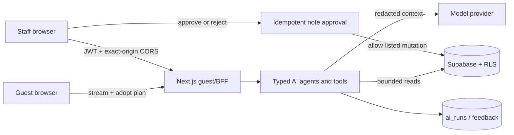

# Wild Oasis AI Hospitality Platform — Case Study

## 一句话概览

Wild Oasis AI Hospitality Platform 把顾客选房、政策问答和预订预填，与员工风险 Briefing、经营分析和人工审批连接成一个双端产品。AI 负责理解与编排，实时库存、价格、权限和最终写入仍由确定性代码与数据库控制。

## 业务问题

传统住宿预订网站要求顾客自己把人数、日期、预算和设施偏好转换成筛选条件；员工则需要在订单、特殊留言和经营报表间反复切换。直接给模型数据库写权限虽然演示简单，却会引入价格计算错误、越权、敏感信息泄露和不可追踪操作。

这个项目选择了更窄但可验证的 AI 边界：

- 顾客用自然语言描述复杂需求，Concierge 调用实时库存与政策工具，返回可解释的推荐卡；“采用方案”只预填，仍由用户确认预订。
- 员工从原始特殊留言旁查看风险 Briefing，并可纠错反馈；AI 失败不阻断入住、退房或订单操作。
- 经营 Copilot 把自然语言问题映射为 KPI、图表和订单卡。唯一写动作只是内部备注草稿，必须由员工明确批准或拒绝。
- 所有 AI 入口使用类型化工具、服务端鉴权、限流、超时、受控 telemetry 和降级路径。

## 双端产品

| Surface | 技术 | 主要体验 | 源码入口 |
| --- | --- | --- | --- |
| Guest Experience | Next.js App Router + AI SDK + Supabase | AI 选房、政策问答、预订预填 | [顾客网站 README](https://github.com/notjustkoala/the-wild-oasis-video/blob/codex/ai-hospitality-platform/README.md) |
| Staff Operations | React + Vite + Supabase + Recharts | 风险 Briefing、经营 Copilot、审批/拒绝 | [运营后台 README](../../README.md) |
| Shared BFF / Data | Next.js Route Handlers + Supabase RLS | 鉴权、工具、观测、反馈、写入审批 | [部署与数据保护](DEPLOYMENT_RUNBOOK.md) |

跨仓库链接指向两个独立 GitHub origin 的固定
`codex/ai-hospitality-platform` 分支；Feature06 当前尚未 push，发布后必须逐项实点验证，不能把预期 URL 当作已可访问证据。

当前仓库没有已核验的公开部署 URL。作品集不能把 `guest.example` / `staff.example` 或本地地址写成线上链接；真实地址发布后按 [部署 Runbook](DEPLOYMENT_RUNBOOK.md) 登记并执行 smoke。

## 架构




信任边界的核心是：浏览器输入和模型输出都不被当作授权或事实来源。BFF 重建受信消息、验证 `app_metadata.role`，工具再查询当前数据；数据库 RLS 和显式 grants 是最后一道边界。

## 关键工程取舍

### 1. 模型编排，不拥有业务规则

模型选择工具并组织解释；库存重叠、容量、价格、权限和预订创建都由确定性代码处理。这样牺牲了“模型一步完成”的表面流畅度，换来可测试、可追溯和可人工确认的结果。

### 2. 两个前端，一个服务端 AI 边界

员工端没有模型密钥或 Supabase server secret。它携带当前员工 access token 调用顾客端的 BFF；BFF 重新验证身份和角色，并用精确 origin CORS 限制跨站调用。这个选择减少了重复的 AI 后端，同时要求部署时正确绑定两个 origin。

### 3. 最小写权限与人工审批

顾客 Concierge 没有创建订单工具。运营 Copilot 的唯一写能力是内部备注草稿；审批 RPC 只能更新 allow-listed 字段且具备幂等审计。复杂或高风险操作保留在人类手里。

### 4. 隐私优先的观测

Telemetry 保存 trace UUID、受控状态/错误码、耗时、token 数、工具名与版本，不保存 prompt、answer、工具参数、用户 ID 或原始错误。Trace ID 本身不能提交反馈，反馈需要一小时有效的签名 receipt。

### 5. 证据分层

离线 contract eval、HTTP fixture 浏览器测试、真实模型、真实开发数据库与生产 smoke 分开报告。这避免把“69 条离线全通过”误写成“模型准确率 100%”，也避免把 fixture 截图冒充线上证据。详细口径见 [AI Eval Report](AI_EVAL_REPORT.md)。

## 代表性结果

- 69 条固定离线用例：工具选择 45/45、硬约束 69/69、引用 24/24、授权 64/64；属于确定性契约/合成检索验证。
- 真实模型首批 10 个固定场景通过 8 个，P50 7.807 秒、P95 20.264 秒；两个失败在后续独立单场补验中分别通过，因此只能表述为“10 个不同固定场景分批取得通过”。
- 两端各 5 个浏览器 fixture 场景覆盖成功、空结果、超时、拒绝与恢复路径。
- 真实 HTTP 拒绝覆盖 401/403/400；真实开发数据库并发限流探针在 5 个请求中允许 2 个、拒绝 3 个，并确认 0 个测试 bucket 残留。
- 没有经核验的模型价格文件，单次成本保持 unknown；没有用户增长或转化数据。

每个数字的来源、分母和限制都列在 [AI Eval Report](AI_EVAL_REPORT.md)。

## 五分钟讲解路径

1. 顾客提出含日期、人数、预算与偏好的复杂需求，查看实时推荐并预填预订。
2. 使用专用 `DEMO_ADMIN` 查看 admin-only 风险 Briefing，对 AI 标签作人工纠错。
3. 切换到最小权限 `DEMO_STAFF` 向 Copilot 询问经营问题，查看 KPI/图表/订单卡，并拒绝或确认内部备注草稿。
4. 展示一次越权拒绝以及 Eval/Tracing 报告，说明项目不只准备成功路径。

完整话术、计时点、失败切换和录屏清单见 [Demo Script](DEMO_SCRIPT.md)。

## 如何验证

```bash
# 运营后台
cd ../17-the-wild-oasis-ai
npm run check
npm run docs:check

# 顾客网站 / BFF
cd ../21-the-wild-oasis-website-ai
npm run check
npm run eval:ai
npm run docs:check
```

`eval:ai` 是离线 runner，不调用模型或数据库。付费 live eval、远端迁移和生产 smoke 都是显式 opt-in；参见 [Deployment Runbook](DEPLOYMENT_RUNBOOK.md)。

## 限制与下一步

- 尚无核验后的公开部署 URL、公开演示账号、生产 HTTPS smoke 或真实备用录屏。
- 进程内或数据库限流不等于全球边缘防护；公网部署仍应配置平台 WAF/持久限流策略。
- Live 答案检查使用确定性启发式，不是语义裁判或用户满意度调查。
- 固定 provenance、私有 baseline、单事务 service-only RPC、advisory lock 与默认关闭 Cron 已在本地实现；尚未应用/验证于远端 Demo Project，因此不宣称自动恢复已激活。
- 需要一名不了解项目的人完成 README 阅读、演示操作和架构追问；其复述结果应人工登记，不能由开发者自证。

## 我的前端工程重点

- 把流式 tool calling 结果映射成推荐卡、KPI、图表、订单卡和可恢复状态，而不是只渲染聊天文本。
- 在双端 UI 中保留原始事实、证据 ID、AI 状态、人工纠错和非 AI 业务入口。
- 设计清晰的 loading/empty/timeout/denied/saved/error 状态，确保 AI 失败不劫持预订与员工操作。
- 用共享契约和分层测试把服务端安全边界变成前端可见、可解释的产品行为。
